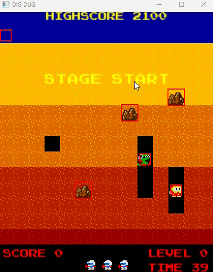

Dig Dug made in CPP using SFML library.
Four main levels and two enemy types (like the original!).

Development:
- Fygar needs to be implemented fully (currently just a Pooka with a reskin).
- Need to add pause menu and main menu.
- AI pathfinding is botched.
- This is pretty much abandoned, might come back later.